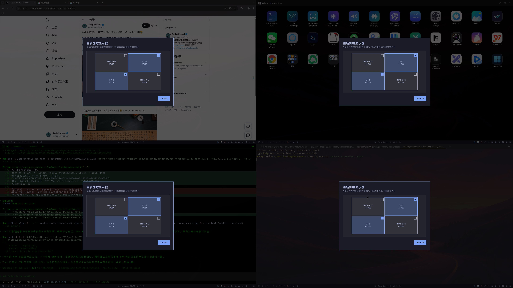

# Display Reset

English | [简体中文](README.zh-CN.md)



This Omarchy Shell plugin adds an icon to the right side of the bar. Clicking it opens the same dialog on every monitor. The dialog arranges monitors using their current coordinates and rotation from `hyprctl monitors -j`. Selecting a monitor in any dialog updates the selection in all of them.

After you click **Reload**, the plugin stops `hyprmoncfgd.service`, backs up `~/.config/hypr/hyprmoncfg-monitors.lua`, and temporarily adds `disabled = true` only to the selected outputs. It runs `hyprctl reload`, waits two seconds, restores the original configuration, reloads again, starts the service, and checks `hyprctl configerrors`. It also attempts to restore the configuration and service if an operation fails. If it detects another process changing the monitor file during the reload, the plugin leaves that change in place, reports the conflict, and keeps the original backup in the runtime directory.

## Requirements

Omarchy Shell and Hyprland are required. The reload action also needs Python 3, `hyprctl`, `systemctl --user`, a running `hyprmoncfgd.service`, and the generated `~/.config/hypr/hyprmoncfg-monitors.lua` file. The local installer additionally uses `jq`.

## Install

From the Omarchy plugin manager:

```bash
omarchy plugin add https://github.com/manateelazycat/omarchy-display-reset.git --enable --yes
```

Or, from a local checkout:

```bash
./install.sh
```

The installer links this project to `~/.config/omarchy/plugins/andy.display-reset` and places its icon on the right side of the bar. After changing the dialog code, run `omarchy restart shell` to load the new version.

You can also open the dialog with `omarchy-shell andy.display-reset show`.

## Remove

```bash
omarchy plugin remove andy.display-reset --yes
```

This also unlinks a local installation without deleting the checkout.

## License

This project is licensed under the GNU General Public License version 3.0 only (`GPL-3.0-only`). See [LICENSE](LICENSE).
